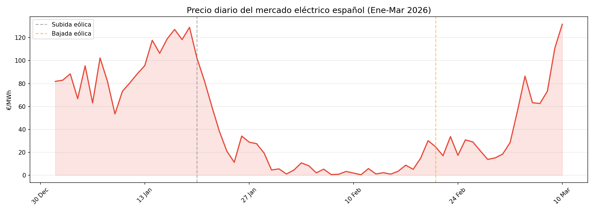
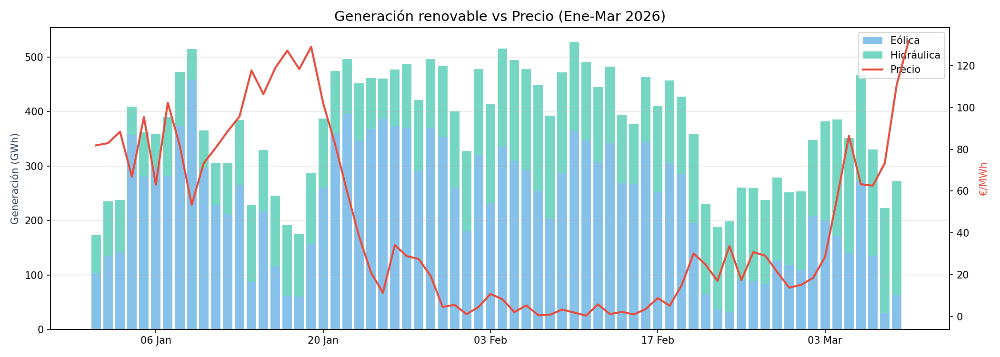
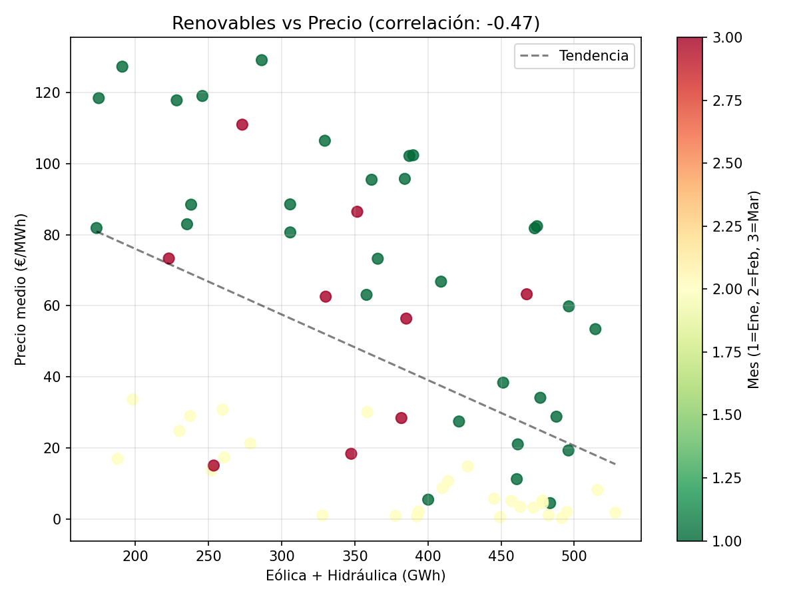
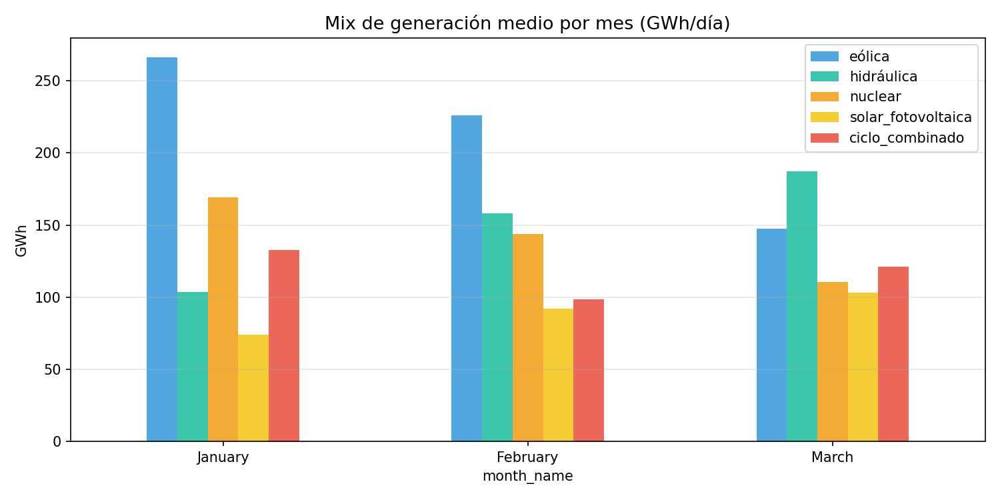

# 🌬️ Cuando el viento y la lluvia abaratan la luz
## Análisis del mercado eléctrico español · Enero–Marzo 2026

Un análisis personal sobre cómo la generación renovable —eólica e hidráulica— afecta al precio de la electricidad en España, usando datos públicos de OMIE y REE.

---

## 🔍 ¿De qué va esto?

Entre enero y marzo de 2026 el precio de la luz en España cayó un **85%** de un mes para otro. No fue magia ni política: fue el viento y la lluvia.

Este proyecto analiza esa caída con datos reales, busca las correlaciones entre generación renovable y precio, y trata de contar una historia que va más allá de los números: **la independencia energética protege a los ciudadanos de la volatilidad de los combustibles fósiles**.

---

## 📊 Hallazgos principales

| Métrica | Valor |
|---|---|
| Precio medio enero | 71.19 €/MWh |
| Precio medio febrero | 10.64 €/MWh |
| Variación | **-85%** |
| Correlación eólica vs precio | -0.324 |
| Correlación hidráulica vs precio | -0.298 |
| Correlación eólica + hidráulica vs precio | **-0.467** |
| Correlación ciclo combinado vs precio | **+0.840** |

El dato más revelador no es la correlación de las renovables, sino la del **ciclo combinado (gas): +0.840**. Cuando hay poco viento, España tira del gas y el precio se dispara. Cuando sopla el viento y llueve, el gas se queda parado y la luz se abarata.

---

## 📖 La historia en tres actos

**Acto 1 · Enero 1–19: el invierno normal**
Mix energético habitual. Poca eólica (60k–170k MWh). Precios altos, entre 102 y 134 €/MWh. El ciclo combinado trabajando a pleno rendimiento.

**Acto 2 · Enero 20 – Febrero 20: el colapso**
Llegan las tormentas. La eólica se dispara hasta 456k MWh en su pico. La hidráulica sube por las lluvias hasta superar 195k MWh. Los precios se desploman: de 134 a 0.3 €/MWh en cuestión de días. El gas se queda sin trabajo.

**Acto 3 · Febrero 21 – Marzo 9: la recuperación**
El viento amaina. La eólica cae a mínimos (30k–270k MWh). La hidráulica aguanta gracias a los embalses llenos. Los precios recuperan terreno (15–110 €/MWh). El contexto geopolítico —tensión en Irán— encarece el gas y amplifica la subida.

---

## 🛠️ Fuentes de datos y herramientas

**Datos**
- [OMIE](https://www.omie.es) — Precios horarios del mercado eléctrico ibérico
- [REE (Red Eléctrica de España)](https://www.ree.es) — Generación diaria por tecnología vía API pública

**Herramientas**
- Python · Pandas · Matplotlib
- Google Colab
- Tableau (visualización final)

---

## 📁 Estructura del repositorio

```
├── data/
│   ├── omie_2026.csv               # Precios horarios OMIE (Ene-Mar 2026)
│   ├── omie_hourly.csv             # Precios horarios limpios
│   ├── omie_daily.csv              # Precios diarios agregados
│   └── energia_espana_2026_master.csv  # Dataset maestro combinado
├── notebooks/
│   └── analisis_energia_espana.ipynb   # Análisis completo en Colab
├── charts/
│   ├── g1_precio_diario.png
│   ├── g2_renovables_vs_precio.png
│   ├── g3_scatter_renovables_precio.png
│   └── g4_mix_generacion_mensual.png
└── README.md
```

---

## 📈 Visualizaciones

### Evolución del precio diario


### Generación renovable vs Precio


### Correlación renovables vs precio (scatter)


### Mix de generación por mes


---

## 💡 Reflexión final

Los datos de este trimestre ilustran algo que el debate energético a menudo ignora: **las renovables no solo son más baratas, son más predecibles en su efecto sobre el mercado**. Cada GWh extra de viento o agua reduce el precio. Cada GWh de gas lo sube.

La dependencia del gas no es solo un problema medioambiental. Es un problema de soberanía económica.

---

## 👤 Autor

**Guillermo Higueras**  
Data Analyst · Python · SQL · Tableau  
[LinkedIn](https://www.linkedin.com/in/guillermo-higueras-23994020) · [GitHub](https://github.com/ghigueras/portfolio)
